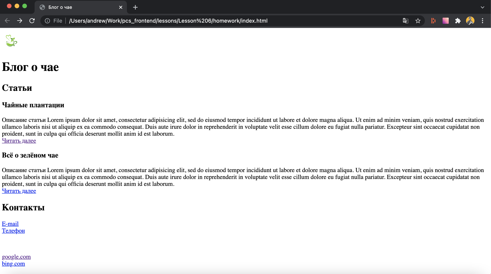
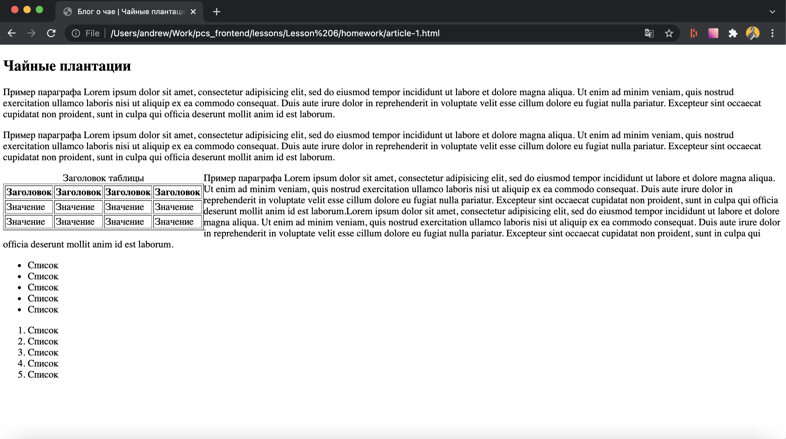

# 01. HTML блог
## Требования
Необходимо соблюдать семантичную вёрстку: использовать
заголовки разных уровней, специальные теги шапки, подвала,
основного контента и секций.

## Задание
1. Создать главную страницу, содержащую:
    1. Хедер (логотип и название)
    1. Секцию списка статей блога (ссылки должны вести на страницы статей)
    1. Секцию контактов (телефонный номер и e-mail в виде ссылки)
    1. Футер (копирайт, несколько внешних ссылок)
1. Создать 2-3 страницы статей, используя внутри статьи следующие
элементы: параграфы, таблицы, маркированные списки, нумерованные списки

## Пример
### Главная страница

### Страница статьи

