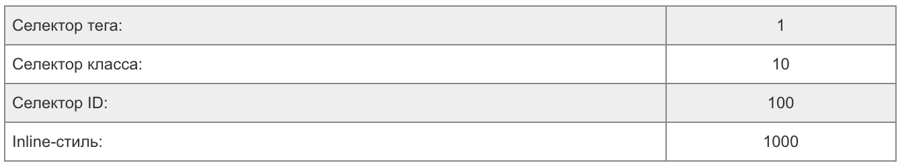
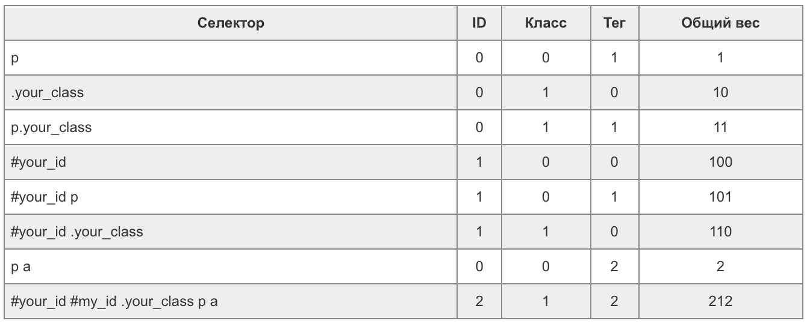

# 09. Комбинирование селекторов, приоритет селекторов

## Материалы
* [CSS-селекторы MDN](https://developer.mozilla.org/ru/docs/Web/CSS/CSS_Selectors)
* [Приоритет селекторов](https://idg.net.ua/blog/uchebnik-css/azy-css/kaskadnost)

## Summary
### Селектор атрибутов
* Можно выбрать элемент по его атрибуту или по значению атрибута
* Для выборки по атрибуту используются квадратные скобки
    ```css
    /* Выбирает все элементы с атрибутом href */
    [href] {
        color: red;
    }
    
    /* Выбирает все элементыы с атрибутом href с */
    /* точным значением https://yandex.ru */
    [href="https://yandex.ru"] {
        color: yellow;
    }
    
    /* Выбирает все элементы с атрибутом class, */
    /* содержащим значение class-1 (одно из значений через пробел) */    
    [class~="class-1"] {
        color: grey;
    }
    
    /* Выбирает все элементы с атрибутом class, */
    /* содержащим значение classs до дефиса (полное */
    /* значение может быть classs-1, classs-2, classs-whatever... */
    [class|="classs"] {
        color: green;
    }
    
    /* Выбирает все элементы с атрибутом href, значение которых */ 
    /* начинается с https://vk */
    [href^="https://vk"] {
        color: purple;
    }
    
     /* Выбирает все элементы с атрибутом href, значение которых */
     /* заканчивается на .org */
    [href$=".org"] {
        color: #a5cfb0;
    }
    
    /* Выбирает все элементы с атрибутом href, значение которых */ 
    /* в любом месте содержит example*/
    [href*="example"] {
        color: #2ee8e5;
    }
  
    /* Тоже самое, что и предыдущее, только нечувствительное к регистру */
    [href*="examplE"i] {
        color: #2ee8e5;
    }
    ```

### Приоритет подключаемых стилей
* Существует три основных способа подключения стилей: файл, тег `<style>` и инлайн
* Приоритетнее всего инлайн-стили - они будут применятся и перекрывать все остальные
* На втором месте по приоритетам стили из тега `<style>`, они будут перекрывать файловыее стили
* На третьем месте - стили в файле

### Приоритет селекторов
* Каждый селектор имеет свой числовой приоритет (вес)

  
* При комбинировании селекторов приоритет складывается

  
* Если приоритеты селекторов совпадают по весу, то применяется тот, который находится ниже в CSS коде.
