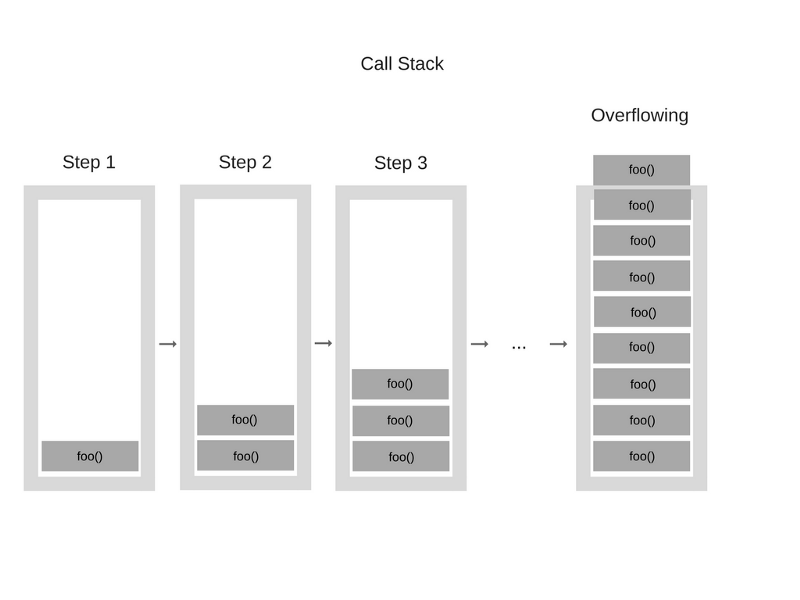

# 23. Рекурсия, setTimeout, setInterval, Promise, fetch API

## Материалы
* [Код с урока](src)

## Summary
### Рекурсия
* Рекурсивная функия в JavaScript - функция, которая в своём теле использует вызов самой себя
* С рекурсией нужно быть аккуратным: если не задать условие выхода из бесконечного вызова функцией самой себя - программа вылетит из-за превышения лимита стека
* Стек вызовов — это структура данных, которая, говоря упрощённо, записывает сведения о месте в программе, где мы находимся.
* Функции перед выполнением записываются в стек вызовов и удаляются оттуда, когда завершили выполнение
* Однако, вызывая в функции саму себя, текущая функция не завершает исполнение, поэтому с каждым новым вызовом новая функция добавляется в стек.

#### Пример работы стека вызовов
Предположим, есть такой код:
```js
function multiply(x, y) {
    return x * y;
}
function printSquare(x) {
    var s = multiply(x, x);
    console.log(s);
}
printSquare(5);
```

Картинка ниже описывает пошагово состояние стека вызовов:


Если будет достигнут максимальный размер стека, произойдёт переполнение, например, в случае рекурсии без условия выхода:
```js
function foo() {
    foo();
}
foo();
```
Стек в этом случае выглядит вот так:



#### Пример рекурсивной функции
Примером рекурсивной функции может выступить функция подсчёта факториала числа.

```js
function factorial(n) {
    // обязательно иметь условие выхода.
    // И обязательно сделать так, чтобы вв нужный момент это условие выполнилось.
    // Иначе рекурсия будет бесконечной.
    if (n === 1) {
        return 1;
    }
    
    return n * factorial(n - 1);
}
```

### `setTimeout`
Функция позволяет выполнить какой-либо код с задержкой.
```js
setTimeout(() => {
    // код в этой функции выполнится с задержкой
}, 1000);
```

* Задержка пишется в милисекундах - 1000 - это 1 секунда
* Значение 1000 - неточное. Это минимальное время, через которое выполнится эта функция. Реальное время паузы может оказаться дольше


### `setInterval`
Функция позволяет выполнять какой-либо код периодически через определённый интервал времени.
```js
// Данный код будет выводить в консоль hello world
// через каждые 1000 милисекунд
setInterval(() => {
    console.log('Hello world!');
}, 1000);
```

* Время 1000 милисекунд - это минимальное время интервала. Реальный интервал может оказаться больше.
* Выполнение кода не остановится, пока вы не перезагрузите страницу
* Можно выключить выполнение заданной функции, но для этого внутреннюю функцию нужно задать явно:
```js
function handler() {
    console.log('Hello World');
}
setInterval(handler, 1000);

// чтобы очистить, нужно использовать функцию clearInterval,
// указав в качестве параметра ту же функцию, которая была задана
// при создании интервала
clearInterval(hanlder);
```


### Promise
* Промисы используются для обработки асинхронных вычислений.
* Чаще всего используются для получения данных с сервера: обычно время ответа точно угадать нельзя, поэтому нужно подождать, пока данные придут и затем выполнить какой-то код
* Но пример промиса можно сделать и без получения данных с сервера:
```js
const promise = new Promise((resolve, reject) => {
    // Код внутри Promise выполнится спустя секунду из-за timeout
    // Мы как бы имитируем ответ от сервера с задержкой
   setTimeout(() => {
       // После вызова функции resolve начнётся выполнение функции,
       // помещённой в then (ниже в коде)
       resolve();
   }, 1000); 
});

promise.then(() => {
    // выведется после вызова resolve()
    console.log('Промис завершился успешно');
}).catch(() => {
    // выведется, если была вызвана функция reject() вместо resolve()
    console.log('Промис завершился неудачно');
}).finally(() => {
    // Выведется в любом случае после then или catch
    console.log('Промис завершился');
})
```

### fetch API
* fetch используется для получения данных с сервера, API и т.п. по URL.
* fetch возвращает Promise, поэтому конструкция выглядит следующим обраазом:
```js
fetch('http://example.com/movies.json')
    .then(response => response.json())
    .then((data) => {
        console.log(data);
    });
```
